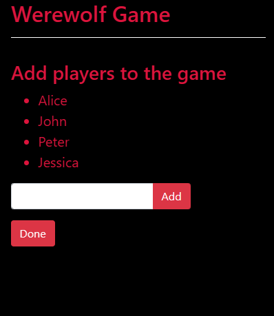
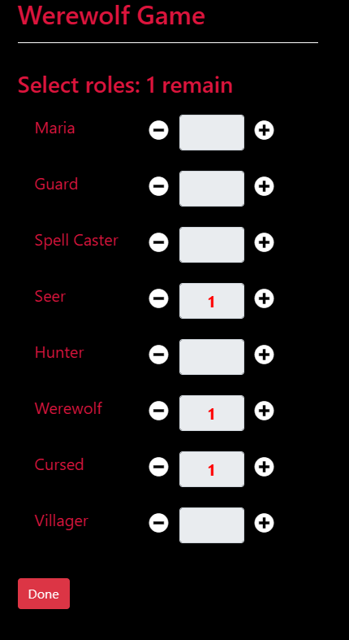
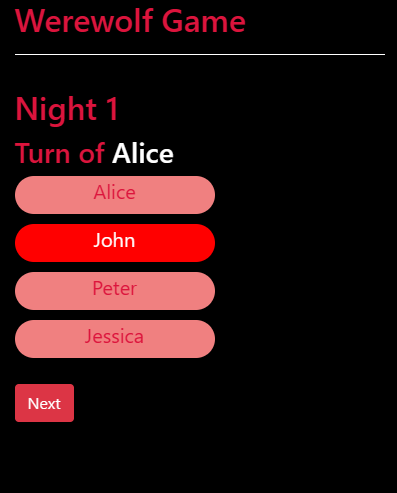
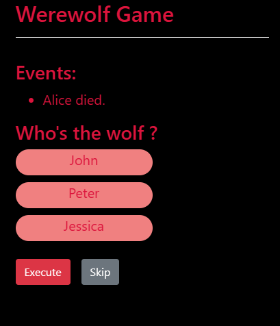
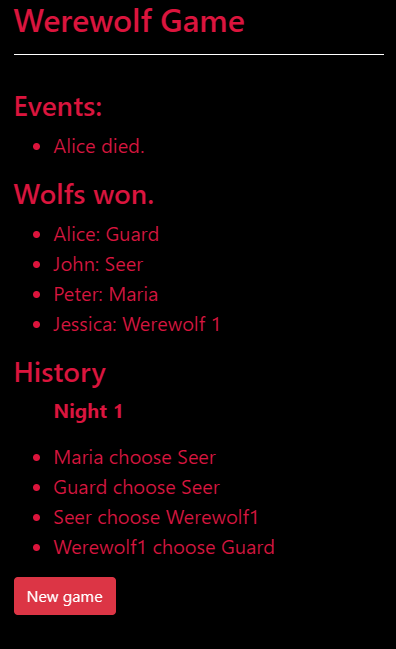

# Werewolf Game (blind version)
This game is an alternative of [Ultimate Werewolf](https://en.wikipedia.org/wiki/Ultimate_Werewolf) 
where all players don't know about their role. The only one that know it is The Host. 
At night, everyone perform their actions by choosing a player. At day, The Host informs what was the result of performed actions last night. 
With that information, the players have to figure out what their role is, which
side they are in, and what they need to do to win the game.

So, The Host needs to remember and process a lot of information every night. This app works as
an assistant to help it. 

## Run
### `npm start`

## Game
(_I designed this app to fit phone screens_)

### Setup players
Add players to the game.

### Setup roles

- Maria: The ability of the player chose by her will be disabled for that night (for example, if he is a werewolf, his bite won't cause any damage).
- Guard: The player chose by him will be protected (won't die if be bitten).
- Spell Caster: The player chose by her will be muted (can't talk the day after).
- Seer: The player chose by him needs to tell which person they chose last night.
- Hunter: If the hunter is bitten, the player chose by him will be dead too.
- Werewolf: The player chose by werewolf will be dead the next day. If there are more than 1 werewolf, 
only the bite of the first werewolf matters (if the first werewolf is dead, the next one does, and so on).
- Cursed: If the cursed is bitten the first time, he becomes a werewolf.
- Villager: Eh... nothing special.

### At night
Everyone chooses a player to perform their action (which can be themselves).

### At day
The app shows what is the result of those actions. Now everybody discuss and vote for the one they think is a werewolf, or skip the execution if they have no idea yet.

### Game over
when all the wolf are dead, or they have killed enough, the game ends.

Now the app shows roles of everybody and all actions made.

